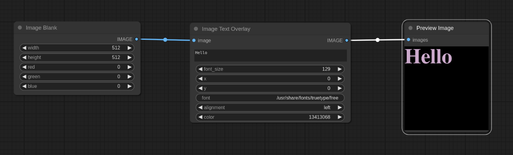

# ComfyUI - Text Overlay Plugin

## Overview
The ComfyUI Text Overlay Plugin provides functionalities for superimposing text on images. Users can select different font types, set text size, choose color, and adjust the text's position on the image.

## Features

- **Text Placement**: Specify `x` and `y` coordinates to determine the text's position on the image.
- **Font Selection**: Provide a path to any font on your system to utilize it within the plugin.
- **Font Size**: Adjust the text size based on your requirements.
- **Text Alignment**: Align text to the left, center, or right relative to the specified `x` coordinate.
- **Color Customization**: Define the text color using RGB values.

## Usage

* Add the "Image Text Overlay" plugin
* Attach an image
* Output to an image

Works well with controlnet.

## Feedback & Contributions

If you have feedback or would like to contribute to the development of this plugin, please submit a pull request.

